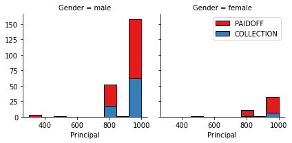
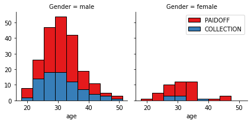
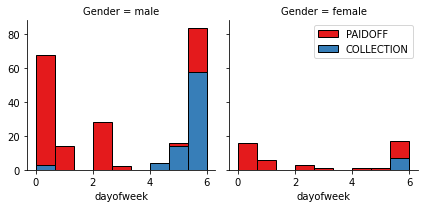
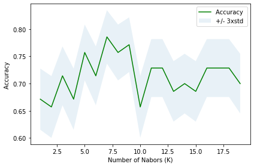

<a href="https://www.bigdatauniversity.com"></a>

<h1 align="center"><font size="5">Classification with Python</font></h1>

In this notebook we try to practice all the classification algorithms that we learned in this course.

We load a dataset using Pandas library, and apply the following algorithms, and find the best one for this specific dataset by accuracy evaluation methods.

Lets first load required libraries:


```python
import itertools
import numpy as np
import matplotlib.pyplot as plt
from matplotlib.ticker import NullFormatter
import pandas as pd
import numpy as np
import matplotlib.ticker as ticker
from sklearn import preprocessing
%matplotlib inline
```

### About dataset

This dataset is about past loans. The __Loan_train.csv__ data set includes details of 346 customers whose loan are already paid off or defaulted. It includes following fields:

| Field          | Description                                                                           |
|----------------|---------------------------------------------------------------------------------------|
| Loan_status    | Whether a loan is paid off on in collection                                           |
| Principal      | Basic principal loan amount at the                                                    |
| Terms          | Origination terms which can be weekly (7 days), biweekly, and monthly payoff schedule |
| Effective_date | When the loan got originated and took effects                                         |
| Due_date       | Since it’s one-time payoff schedule, each loan has one single due date                |
| Age            | Age of applicant                                                                      |
| Education      | Education of applicant                                                                |
| Gender         | The gender of applicant                                                               |

Lets download the dataset
!wget -O loan_train.csv https://s3-api.us-geo.objectstorage.softlayer.net/cf-courses-data/CognitiveClass/ML0101ENv3/labs/loan_train.csv

```python
# local path to csv 
trainpath = "../data/loan_train.csv"
```

### Load Data From CSV File  


```python
df = pd.read_csv(trainpath)
df.head()
```


<div>
<style scoped>
    .dataframe tbody tr th:only-of-type {
        vertical-align: middle;
    }

    .dataframe tbody tr th {
        vertical-align: top;
    }

    .dataframe thead th {
        text-align: right;
    }
</style>
<table border="1" class="dataframe">
  <thead>
    <tr style="text-align: right;">
      <th></th>
      <th>Unnamed: 0</th>
      <th>Unnamed: 0.1</th>
      <th>loan_status</th>
      <th>Principal</th>
      <th>terms</th>
      <th>effective_date</th>
      <th>due_date</th>
      <th>age</th>
      <th>education</th>
      <th>Gender</th>
    </tr>
  </thead>
  <tbody>
    <tr>
      <th>0</th>
      <td>0</td>
      <td>0</td>
      <td>PAIDOFF</td>
      <td>1000</td>
      <td>30</td>
      <td>9/8/2016</td>
      <td>10/7/2016</td>
      <td>45</td>
      <td>High School or Below</td>
      <td>male</td>
    </tr>
    <tr>
      <th>1</th>
      <td>2</td>
      <td>2</td>
      <td>PAIDOFF</td>
      <td>1000</td>
      <td>30</td>
      <td>9/8/2016</td>
      <td>10/7/2016</td>
      <td>33</td>
      <td>Bechalor</td>
      <td>female</td>
    </tr>
    <tr>
      <th>2</th>
      <td>3</td>
      <td>3</td>
      <td>PAIDOFF</td>
      <td>1000</td>
      <td>15</td>
      <td>9/8/2016</td>
      <td>9/22/2016</td>
      <td>27</td>
      <td>college</td>
      <td>male</td>
    </tr>
    <tr>
      <th>3</th>
      <td>4</td>
      <td>4</td>
      <td>PAIDOFF</td>
      <td>1000</td>
      <td>30</td>
      <td>9/9/2016</td>
      <td>10/8/2016</td>
      <td>28</td>
      <td>college</td>
      <td>female</td>
    </tr>
    <tr>
      <th>4</th>
      <td>6</td>
      <td>6</td>
      <td>PAIDOFF</td>
      <td>1000</td>
      <td>30</td>
      <td>9/9/2016</td>
      <td>10/8/2016</td>
      <td>29</td>
      <td>college</td>
      <td>male</td>
    </tr>
  </tbody>
</table>
</div>


```python
df.shape
```


    (346, 10)


### Convert to date time object 


```python
df['due_date'] = pd.to_datetime(df['due_date'])
df['effective_date'] = pd.to_datetime(df['effective_date'])
df.head()
```


<div>
<style scoped>
    .dataframe tbody tr th:only-of-type {
        vertical-align: middle;
    }

    .dataframe tbody tr th {
        vertical-align: top;
    }

    .dataframe thead th {
        text-align: right;
    }
</style>
<table border="1" class="dataframe">
  <thead>
    <tr style="text-align: right;">
      <th></th>
      <th>Unnamed: 0</th>
      <th>Unnamed: 0.1</th>
      <th>loan_status</th>
      <th>Principal</th>
      <th>terms</th>
      <th>effective_date</th>
      <th>due_date</th>
      <th>age</th>
      <th>education</th>
      <th>Gender</th>
    </tr>
  </thead>
  <tbody>
    <tr>
      <th>0</th>
      <td>0</td>
      <td>0</td>
      <td>PAIDOFF</td>
      <td>1000</td>
      <td>30</td>
      <td>2016-09-08</td>
      <td>2016-10-07</td>
      <td>45</td>
      <td>High School or Below</td>
      <td>male</td>
    </tr>
    <tr>
      <th>1</th>
      <td>2</td>
      <td>2</td>
      <td>PAIDOFF</td>
      <td>1000</td>
      <td>30</td>
      <td>2016-09-08</td>
      <td>2016-10-07</td>
      <td>33</td>
      <td>Bechalor</td>
      <td>female</td>
    </tr>
    <tr>
      <th>2</th>
      <td>3</td>
      <td>3</td>
      <td>PAIDOFF</td>
      <td>1000</td>
      <td>15</td>
      <td>2016-09-08</td>
      <td>2016-09-22</td>
      <td>27</td>
      <td>college</td>
      <td>male</td>
    </tr>
    <tr>
      <th>3</th>
      <td>4</td>
      <td>4</td>
      <td>PAIDOFF</td>
      <td>1000</td>
      <td>30</td>
      <td>2016-09-09</td>
      <td>2016-10-08</td>
      <td>28</td>
      <td>college</td>
      <td>female</td>
    </tr>
    <tr>
      <th>4</th>
      <td>6</td>
      <td>6</td>
      <td>PAIDOFF</td>
      <td>1000</td>
      <td>30</td>
      <td>2016-09-09</td>
      <td>2016-10-08</td>
      <td>29</td>
      <td>college</td>
      <td>male</td>
    </tr>
  </tbody>
</table>
</div>


# Data visualization and pre-processing


Let’s see how many of each class is in our data set 


```python
df['loan_status'].value_counts()
```


    PAIDOFF       260
    COLLECTION     86
    Name: loan_status, dtype: int64


260 people have paid off the loan on time while 86 have gone into collection 


Lets plot some columns to underestand data better:
# notice: installing seaborn might takes a few minutes
#!conda install -c anaconda seaborn -y
!pip install seaborn

```python
import seaborn as sns

bins = np.linspace(df.Principal.min(), df.Principal.max(), 10)
g = sns.FacetGrid(df, col="Gender", hue="loan_status", palette="Set1", col_wrap=2)
g.map(plt.hist, 'Principal', bins=bins, ec="k")

g.axes[-1].legend()
plt.show()
```





```python
bins = np.linspace(df.age.min(), df.age.max(), 10)
g = sns.FacetGrid(df, col="Gender", hue="loan_status", palette="Set1", col_wrap=2)
g.map(plt.hist, 'age', bins=bins, ec="k")

g.axes[-1].legend()
plt.show()
```





# Pre-processing:  Feature selection/extraction

### Lets look at the day of the week people get the loan 


```python
df['dayofweek'] = df['effective_date'].dt.dayofweek
bins = np.linspace(df.dayofweek.min(), df.dayofweek.max(), 10)
g = sns.FacetGrid(df, col="Gender", hue="loan_status", palette="Set1", col_wrap=2)
g.map(plt.hist, 'dayofweek', bins=bins, ec="k")
g.axes[-1].legend()
plt.show()

```





We see that people who get the loan at the end of the week dont pay it off, so lets use Feature binarization to set a threshold values less then day 4 


```python
df['weekend'] = df['dayofweek'].apply(lambda x: 1 if (x>3)  else 0)
df.head()
```


<div>
<style scoped>
    .dataframe tbody tr th:only-of-type {
        vertical-align: middle;
    }

    .dataframe tbody tr th {
        vertical-align: top;
    }

    .dataframe thead th {
        text-align: right;
    }
</style>
<table border="1" class="dataframe">
  <thead>
    <tr style="text-align: right;">
      <th></th>
      <th>Unnamed: 0</th>
      <th>Unnamed: 0.1</th>
      <th>loan_status</th>
      <th>Principal</th>
      <th>terms</th>
      <th>effective_date</th>
      <th>due_date</th>
      <th>age</th>
      <th>education</th>
      <th>Gender</th>
      <th>dayofweek</th>
      <th>weekend</th>
    </tr>
  </thead>
  <tbody>
    <tr>
      <th>0</th>
      <td>0</td>
      <td>0</td>
      <td>PAIDOFF</td>
      <td>1000</td>
      <td>30</td>
      <td>2016-09-08</td>
      <td>2016-10-07</td>
      <td>45</td>
      <td>High School or Below</td>
      <td>male</td>
      <td>3</td>
      <td>0</td>
    </tr>
    <tr>
      <th>1</th>
      <td>2</td>
      <td>2</td>
      <td>PAIDOFF</td>
      <td>1000</td>
      <td>30</td>
      <td>2016-09-08</td>
      <td>2016-10-07</td>
      <td>33</td>
      <td>Bechalor</td>
      <td>female</td>
      <td>3</td>
      <td>0</td>
    </tr>
    <tr>
      <th>2</th>
      <td>3</td>
      <td>3</td>
      <td>PAIDOFF</td>
      <td>1000</td>
      <td>15</td>
      <td>2016-09-08</td>
      <td>2016-09-22</td>
      <td>27</td>
      <td>college</td>
      <td>male</td>
      <td>3</td>
      <td>0</td>
    </tr>
    <tr>
      <th>3</th>
      <td>4</td>
      <td>4</td>
      <td>PAIDOFF</td>
      <td>1000</td>
      <td>30</td>
      <td>2016-09-09</td>
      <td>2016-10-08</td>
      <td>28</td>
      <td>college</td>
      <td>female</td>
      <td>4</td>
      <td>1</td>
    </tr>
    <tr>
      <th>4</th>
      <td>6</td>
      <td>6</td>
      <td>PAIDOFF</td>
      <td>1000</td>
      <td>30</td>
      <td>2016-09-09</td>
      <td>2016-10-08</td>
      <td>29</td>
      <td>college</td>
      <td>male</td>
      <td>4</td>
      <td>1</td>
    </tr>
  </tbody>
</table>
</div>


## Convert Categorical features to numerical values

Lets look at gender:


```python
df.groupby(['Gender'])['loan_status'].value_counts(normalize=True)
```


    Gender  loan_status
    female  PAIDOFF        0.865385
            COLLECTION     0.134615
    male    PAIDOFF        0.731293
            COLLECTION     0.268707
    Name: loan_status, dtype: float64


86 % of female pay there loans while only 73 % of males pay there loan


Lets convert male to 0 and female to 1:


```python
df['Gender'].replace(to_replace=['male','female'], value=[0,1],inplace=True)
df.head()
```


<div>
<style scoped>
    .dataframe tbody tr th:only-of-type {
        vertical-align: middle;
    }

    .dataframe tbody tr th {
        vertical-align: top;
    }

    .dataframe thead th {
        text-align: right;
    }
</style>
<table border="1" class="dataframe">
  <thead>
    <tr style="text-align: right;">
      <th></th>
      <th>Unnamed: 0</th>
      <th>Unnamed: 0.1</th>
      <th>loan_status</th>
      <th>Principal</th>
      <th>terms</th>
      <th>effective_date</th>
      <th>due_date</th>
      <th>age</th>
      <th>education</th>
      <th>Gender</th>
      <th>dayofweek</th>
      <th>weekend</th>
    </tr>
  </thead>
  <tbody>
    <tr>
      <th>0</th>
      <td>0</td>
      <td>0</td>
      <td>PAIDOFF</td>
      <td>1000</td>
      <td>30</td>
      <td>2016-09-08</td>
      <td>2016-10-07</td>
      <td>45</td>
      <td>High School or Below</td>
      <td>0</td>
      <td>3</td>
      <td>0</td>
    </tr>
    <tr>
      <th>1</th>
      <td>2</td>
      <td>2</td>
      <td>PAIDOFF</td>
      <td>1000</td>
      <td>30</td>
      <td>2016-09-08</td>
      <td>2016-10-07</td>
      <td>33</td>
      <td>Bechalor</td>
      <td>1</td>
      <td>3</td>
      <td>0</td>
    </tr>
    <tr>
      <th>2</th>
      <td>3</td>
      <td>3</td>
      <td>PAIDOFF</td>
      <td>1000</td>
      <td>15</td>
      <td>2016-09-08</td>
      <td>2016-09-22</td>
      <td>27</td>
      <td>college</td>
      <td>0</td>
      <td>3</td>
      <td>0</td>
    </tr>
    <tr>
      <th>3</th>
      <td>4</td>
      <td>4</td>
      <td>PAIDOFF</td>
      <td>1000</td>
      <td>30</td>
      <td>2016-09-09</td>
      <td>2016-10-08</td>
      <td>28</td>
      <td>college</td>
      <td>1</td>
      <td>4</td>
      <td>1</td>
    </tr>
    <tr>
      <th>4</th>
      <td>6</td>
      <td>6</td>
      <td>PAIDOFF</td>
      <td>1000</td>
      <td>30</td>
      <td>2016-09-09</td>
      <td>2016-10-08</td>
      <td>29</td>
      <td>college</td>
      <td>0</td>
      <td>4</td>
      <td>1</td>
    </tr>
  </tbody>
</table>
</div>


## One Hot Encoding  
#### How about education?


```python
df.groupby(['education'])['loan_status'].value_counts(normalize=True)
```


    education             loan_status
    Bechalor              PAIDOFF        0.750000
                          COLLECTION     0.250000
    High School or Below  PAIDOFF        0.741722
                          COLLECTION     0.258278
    Master or Above       COLLECTION     0.500000
                          PAIDOFF        0.500000
    college               PAIDOFF        0.765101
                          COLLECTION     0.234899
    Name: loan_status, dtype: float64


#### Feature befor One Hot Encoding


```python
df[['Principal','terms','age','Gender','education']].head()
```


<div>
<style scoped>
    .dataframe tbody tr th:only-of-type {
        vertical-align: middle;
    }

    .dataframe tbody tr th {
        vertical-align: top;
    }

    .dataframe thead th {
        text-align: right;
    }
</style>
<table border="1" class="dataframe">
  <thead>
    <tr style="text-align: right;">
      <th></th>
      <th>Principal</th>
      <th>terms</th>
      <th>age</th>
      <th>Gender</th>
      <th>education</th>
    </tr>
  </thead>
  <tbody>
    <tr>
      <th>0</th>
      <td>1000</td>
      <td>30</td>
      <td>45</td>
      <td>0</td>
      <td>High School or Below</td>
    </tr>
    <tr>
      <th>1</th>
      <td>1000</td>
      <td>30</td>
      <td>33</td>
      <td>1</td>
      <td>Bechalor</td>
    </tr>
    <tr>
      <th>2</th>
      <td>1000</td>
      <td>15</td>
      <td>27</td>
      <td>0</td>
      <td>college</td>
    </tr>
    <tr>
      <th>3</th>
      <td>1000</td>
      <td>30</td>
      <td>28</td>
      <td>1</td>
      <td>college</td>
    </tr>
    <tr>
      <th>4</th>
      <td>1000</td>
      <td>30</td>
      <td>29</td>
      <td>0</td>
      <td>college</td>
    </tr>
  </tbody>
</table>
</div>


#### Use one hot encoding technique to conver categorical varables to binary variables and append them to the feature Data Frame 


```python
Feature = df[['Principal','terms','age','Gender','weekend']]
Feature = pd.concat([Feature,pd.get_dummies(df['education'])], axis=1)
Feature.drop(['Master or Above'], axis = 1,inplace=True)
Feature.head()

```


<div>
<style scoped>
    .dataframe tbody tr th:only-of-type {
        vertical-align: middle;
    }

    .dataframe tbody tr th {
        vertical-align: top;
    }

    .dataframe thead th {
        text-align: right;
    }
</style>
<table border="1" class="dataframe">
  <thead>
    <tr style="text-align: right;">
      <th></th>
      <th>Principal</th>
      <th>terms</th>
      <th>age</th>
      <th>Gender</th>
      <th>weekend</th>
      <th>Bechalor</th>
      <th>High School or Below</th>
      <th>college</th>
    </tr>
  </thead>
  <tbody>
    <tr>
      <th>0</th>
      <td>1000</td>
      <td>30</td>
      <td>45</td>
      <td>0</td>
      <td>0</td>
      <td>0</td>
      <td>1</td>
      <td>0</td>
    </tr>
    <tr>
      <th>1</th>
      <td>1000</td>
      <td>30</td>
      <td>33</td>
      <td>1</td>
      <td>0</td>
      <td>1</td>
      <td>0</td>
      <td>0</td>
    </tr>
    <tr>
      <th>2</th>
      <td>1000</td>
      <td>15</td>
      <td>27</td>
      <td>0</td>
      <td>0</td>
      <td>0</td>
      <td>0</td>
      <td>1</td>
    </tr>
    <tr>
      <th>3</th>
      <td>1000</td>
      <td>30</td>
      <td>28</td>
      <td>1</td>
      <td>1</td>
      <td>0</td>
      <td>0</td>
      <td>1</td>
    </tr>
    <tr>
      <th>4</th>
      <td>1000</td>
      <td>30</td>
      <td>29</td>
      <td>0</td>
      <td>1</td>
      <td>0</td>
      <td>0</td>
      <td>1</td>
    </tr>
  </tbody>
</table>
</div>


### Feature selection

Lets defind feature sets, X:


```python
X = Feature
X[0:5]
```


<div>
<style scoped>
    .dataframe tbody tr th:only-of-type {
        vertical-align: middle;
    }

    .dataframe tbody tr th {
        vertical-align: top;
    }

    .dataframe thead th {
        text-align: right;
    }
</style>
<table border="1" class="dataframe">
  <thead>
    <tr style="text-align: right;">
      <th></th>
      <th>Principal</th>
      <th>terms</th>
      <th>age</th>
      <th>Gender</th>
      <th>weekend</th>
      <th>Bechalor</th>
      <th>High School or Below</th>
      <th>college</th>
    </tr>
  </thead>
  <tbody>
    <tr>
      <th>0</th>
      <td>1000</td>
      <td>30</td>
      <td>45</td>
      <td>0</td>
      <td>0</td>
      <td>0</td>
      <td>1</td>
      <td>0</td>
    </tr>
    <tr>
      <th>1</th>
      <td>1000</td>
      <td>30</td>
      <td>33</td>
      <td>1</td>
      <td>0</td>
      <td>1</td>
      <td>0</td>
      <td>0</td>
    </tr>
    <tr>
      <th>2</th>
      <td>1000</td>
      <td>15</td>
      <td>27</td>
      <td>0</td>
      <td>0</td>
      <td>0</td>
      <td>0</td>
      <td>1</td>
    </tr>
    <tr>
      <th>3</th>
      <td>1000</td>
      <td>30</td>
      <td>28</td>
      <td>1</td>
      <td>1</td>
      <td>0</td>
      <td>0</td>
      <td>1</td>
    </tr>
    <tr>
      <th>4</th>
      <td>1000</td>
      <td>30</td>
      <td>29</td>
      <td>0</td>
      <td>1</td>
      <td>0</td>
      <td>0</td>
      <td>1</td>
    </tr>
  </tbody>
</table>
</div>


What are our lables?


```python
y = df['loan_status'].values
y[0:5]
```


    array(['PAIDOFF', 'PAIDOFF', 'PAIDOFF', 'PAIDOFF', 'PAIDOFF'],
          dtype=object)


## Normalize Data 

Data Standardization give data zero mean and unit variance (technically should be done after train test split )


```python
X= preprocessing.StandardScaler().fit(X).transform(X)
X[0:5]
```


    array([[ 0.51578458,  0.92071769,  2.33152555, -0.42056004, -1.20577805,
            -0.38170062,  1.13639374, -0.86968108],
           [ 0.51578458,  0.92071769,  0.34170148,  2.37778177, -1.20577805,
             2.61985426, -0.87997669, -0.86968108],
           [ 0.51578458, -0.95911111, -0.65321055, -0.42056004, -1.20577805,
            -0.38170062, -0.87997669,  1.14984679],
           [ 0.51578458,  0.92071769, -0.48739188,  2.37778177,  0.82934003,
            -0.38170062, -0.87997669,  1.14984679],
           [ 0.51578458,  0.92071769, -0.3215732 , -0.42056004,  0.82934003,
            -0.38170062, -0.87997669,  1.14984679]])


 Classification 

Now, it is your turn, use the training set to build an accurate model. Then use the test set to report the accuracy of the model
You should use the following algorithm:
- K Nearest Neighbor(KNN)
- Decision Tree
- Support Vector Machine
- Logistic Regression


__ Notice:__ 
- You can go above and change the pre-processing, feature selection, feature-extraction, and so on, to make a better model.
- You should use either scikit-learn, Scipy or Numpy libraries for developing the classification algorithms.
- You should include the code of the algorithm in the following cells.

# K Nearest Neighbor(KNN)


```python
from sklearn import metrics
from sklearn.model_selection import train_test_split
from sklearn.neighbors import KNeighborsClassifier
```


```python
# split sets again to find best k

X_train, X_test, y_train, y_test = train_test_split(X, y, test_size=0.2, random_state=4)

print ('KNN Train set:', X_train.shape,  y_train.shape)
print ('KNN Test set:', X_test.shape,  y_test.shape)
```

    KNN Train set: (276, 8) (276,)
    KNN Test set: (70, 8) (70,)


```python
# start looking for the perfect k with k=3

k = 3
```


```python
# model training

kNN_model = KNeighborsClassifier(n_neighbors=k).fit(X_train,y_train)
kNN_model
```


    KNeighborsClassifier(n_neighbors=3)


```python
# just checking yhat again

yhat = kNN_model.predict(X_test)
yhat[0:5]
```


    array(['PAIDOFF', 'PAIDOFF', 'PAIDOFF', 'PAIDOFF', 'PAIDOFF'],
          dtype=object)


```python
# search for perfect k, starting with 20:

Ks=20

mean_acc=np.zeros((Ks-1))
std_acc=np.zeros((Ks-1))
ConfustionMx=[];
for n in range(1,Ks):
    
    #Train Model and Predict  
    kNN_model = KNeighborsClassifier(n_neighbors=n).fit(X_train,y_train)
    yhat = kNN_model.predict(X_test)
    
    
    mean_acc[n-1]=np.mean(yhat==y_test);
    
    std_acc[n-1]=np.std(yhat==y_test)/np.sqrt(yhat.shape[0])
mean_acc
```


    array([0.67142857, 0.65714286, 0.71428571, 0.67142857, 0.75714286,
           0.71428571, 0.78571429, 0.75714286, 0.77142857, 0.65714286,
           0.72857143, 0.72857143, 0.68571429, 0.7       , 0.68571429,
           0.72857143, 0.72857143, 0.72857143, 0.7       ])


```python
# plot accuracy for ks

plt.plot(range(1,Ks),mean_acc,'g')
plt.fill_between(range(1,Ks),mean_acc - 1 * std_acc,mean_acc + 1 * std_acc, alpha=0.10)
plt.legend(('Accuracy ', '+/- 3xstd'))
plt.ylabel('Accuracy ')
plt.xlabel('Number of Nabors (K)')
plt.tight_layout()
plt.show()
```





```python
# perfect k = 7 with accuracy score = 0.7857142857142857 

print( "The best accuracy was with", mean_acc.max(), "with k=", mean_acc.argmax()+1)
```

    The best accuracy was with 0.7857142857142857 with k= 7


```python
# build model again with perfect k = 7

k = 7
```


    KNeighborsClassifier(n_neighbors=7)


```python
#########################################################
### KNN model
######################################

kNN_model = KNeighborsClassifier(n_neighbors=k).fit(X_train,y_train)
kNN_model
```


    KNeighborsClassifier(n_neighbors=3)


# Decision Tree


```python
#########################################################
### DT model
######################################

from sklearn.tree import DecisionTreeClassifier

# DT model

DT_model = DecisionTreeClassifier(criterion="entropy", max_depth = 4)
DT_model.fit(X_train,y_train)
DT_model
```


    DecisionTreeClassifier(criterion='entropy', max_depth=4)


```python
# DT predictions

yhat = DT_model.predict(X_test)
yhat
```


    array(['COLLECTION', 'COLLECTION', 'PAIDOFF', 'PAIDOFF', 'PAIDOFF',
           'PAIDOFF', 'PAIDOFF', 'PAIDOFF', 'PAIDOFF', 'COLLECTION',
           'PAIDOFF', 'COLLECTION', 'PAIDOFF', 'PAIDOFF', 'PAIDOFF',
           'PAIDOFF', 'COLLECTION', 'PAIDOFF', 'COLLECTION', 'PAIDOFF',
           'PAIDOFF', 'COLLECTION', 'COLLECTION', 'COLLECTION', 'PAIDOFF',
           'COLLECTION', 'COLLECTION', 'PAIDOFF', 'COLLECTION', 'PAIDOFF',
           'COLLECTION', 'COLLECTION', 'COLLECTION', 'PAIDOFF', 'PAIDOFF',
           'PAIDOFF', 'COLLECTION', 'PAIDOFF', 'COLLECTION', 'PAIDOFF',
           'COLLECTION', 'PAIDOFF', 'PAIDOFF', 'COLLECTION', 'PAIDOFF',
           'COLLECTION', 'COLLECTION', 'COLLECTION', 'PAIDOFF', 'PAIDOFF',
           'PAIDOFF', 'PAIDOFF', 'PAIDOFF', 'PAIDOFF', 'PAIDOFF', 'PAIDOFF',
           'PAIDOFF', 'PAIDOFF', 'COLLECTION', 'PAIDOFF', 'PAIDOFF',
           'PAIDOFF', 'PAIDOFF', 'COLLECTION', 'PAIDOFF', 'COLLECTION',
           'PAIDOFF', 'COLLECTION', 'PAIDOFF', 'PAIDOFF'], dtype=object)


# Support Vector Machine


```python
#########################################################
### SVM model
######################################

from sklearn import svm

SVM_model = svm.SVC()
SVM_model.fit(X_train, y_train) 
```


    SVC()


```python
# SVM predictions

yhat = SVM_model.predict(X_test)
yhat
```


    array(['COLLECTION', 'PAIDOFF', 'PAIDOFF', 'PAIDOFF', 'PAIDOFF',
           'PAIDOFF', 'COLLECTION', 'COLLECTION', 'PAIDOFF', 'PAIDOFF',
           'PAIDOFF', 'PAIDOFF', 'PAIDOFF', 'PAIDOFF', 'PAIDOFF', 'PAIDOFF',
           'COLLECTION', 'PAIDOFF', 'PAIDOFF', 'PAIDOFF', 'PAIDOFF',
           'PAIDOFF', 'COLLECTION', 'COLLECTION', 'PAIDOFF', 'COLLECTION',
           'COLLECTION', 'PAIDOFF', 'PAIDOFF', 'PAIDOFF', 'PAIDOFF',
           'PAIDOFF', 'PAIDOFF', 'PAIDOFF', 'PAIDOFF', 'PAIDOFF', 'PAIDOFF',
           'PAIDOFF', 'COLLECTION', 'PAIDOFF', 'PAIDOFF', 'PAIDOFF',
           'PAIDOFF', 'COLLECTION', 'PAIDOFF', 'PAIDOFF', 'PAIDOFF',
           'PAIDOFF', 'PAIDOFF', 'PAIDOFF', 'PAIDOFF', 'PAIDOFF', 'PAIDOFF',
           'PAIDOFF', 'PAIDOFF', 'PAIDOFF', 'PAIDOFF', 'PAIDOFF', 'PAIDOFF',
           'PAIDOFF', 'PAIDOFF', 'PAIDOFF', 'PAIDOFF', 'COLLECTION',
           'PAIDOFF', 'PAIDOFF', 'PAIDOFF', 'PAIDOFF', 'PAIDOFF', 'PAIDOFF'],
          dtype=object)


# Logistic Regression


```python
#########################################################
### LR model
######################################

from sklearn.linear_model import LogisticRegression

LR_model = LogisticRegression(C=0.01).fit(X_train,y_train)
LR_model
```


    LogisticRegression(C=0.01)


```python
# LR prdeictions

yhat = LR_model.predict(X_test)
yhat
```


    array(['PAIDOFF', 'PAIDOFF', 'PAIDOFF', 'PAIDOFF', 'PAIDOFF', 'PAIDOFF',
           'PAIDOFF', 'PAIDOFF', 'PAIDOFF', 'PAIDOFF', 'PAIDOFF', 'PAIDOFF',
           'PAIDOFF', 'PAIDOFF', 'PAIDOFF', 'PAIDOFF', 'PAIDOFF', 'PAIDOFF',
           'PAIDOFF', 'PAIDOFF', 'PAIDOFF', 'PAIDOFF', 'PAIDOFF', 'PAIDOFF',
           'PAIDOFF', 'PAIDOFF', 'PAIDOFF', 'PAIDOFF', 'PAIDOFF', 'PAIDOFF',
           'PAIDOFF', 'PAIDOFF', 'PAIDOFF', 'PAIDOFF', 'PAIDOFF', 'PAIDOFF',
           'PAIDOFF', 'PAIDOFF', 'PAIDOFF', 'PAIDOFF', 'PAIDOFF', 'PAIDOFF',
           'PAIDOFF', 'PAIDOFF', 'PAIDOFF', 'PAIDOFF', 'PAIDOFF', 'PAIDOFF',
           'PAIDOFF', 'PAIDOFF', 'PAIDOFF', 'PAIDOFF', 'PAIDOFF', 'PAIDOFF',
           'PAIDOFF', 'PAIDOFF', 'PAIDOFF', 'PAIDOFF', 'PAIDOFF', 'PAIDOFF',
           'PAIDOFF', 'PAIDOFF', 'PAIDOFF', 'PAIDOFF', 'PAIDOFF', 'PAIDOFF',
           'PAIDOFF', 'PAIDOFF', 'PAIDOFF', 'PAIDOFF'], dtype=object)


# Model Evaluation using Test set


```python
from sklearn.metrics import jaccard_score
from sklearn.metrics import f1_score
from sklearn.metrics import log_loss
```

First, download and load the test set:
!wget -O loan_test.csv https://s3-api.us-geo.objectstorage.softlayer.net/cf-courses-data/CognitiveClass/ML0101ENv3/labs/loan_test.csv

```python
# local path to test csv
testpath = "../data/loan_test.csv"
```

### Load Test set for evaluation 


```python
df = pd.read_csv(testpath)
df.head()
```


<div>
<style scoped>
    .dataframe tbody tr th:only-of-type {
        vertical-align: middle;
    }

    .dataframe tbody tr th {
        vertical-align: top;
    }

    .dataframe thead th {
        text-align: right;
    }
</style>
<table border="1" class="dataframe">
  <thead>
    <tr style="text-align: right;">
      <th></th>
      <th>Unnamed: 0</th>
      <th>Unnamed: 0.1</th>
      <th>loan_status</th>
      <th>Principal</th>
      <th>terms</th>
      <th>effective_date</th>
      <th>due_date</th>
      <th>age</th>
      <th>education</th>
      <th>Gender</th>
    </tr>
  </thead>
  <tbody>
    <tr>
      <th>0</th>
      <td>1</td>
      <td>1</td>
      <td>PAIDOFF</td>
      <td>1000</td>
      <td>30</td>
      <td>9/8/2016</td>
      <td>10/7/2016</td>
      <td>50</td>
      <td>Bechalor</td>
      <td>female</td>
    </tr>
    <tr>
      <th>1</th>
      <td>5</td>
      <td>5</td>
      <td>PAIDOFF</td>
      <td>300</td>
      <td>7</td>
      <td>9/9/2016</td>
      <td>9/15/2016</td>
      <td>35</td>
      <td>Master or Above</td>
      <td>male</td>
    </tr>
    <tr>
      <th>2</th>
      <td>21</td>
      <td>21</td>
      <td>PAIDOFF</td>
      <td>1000</td>
      <td>30</td>
      <td>9/10/2016</td>
      <td>10/9/2016</td>
      <td>43</td>
      <td>High School or Below</td>
      <td>female</td>
    </tr>
    <tr>
      <th>3</th>
      <td>24</td>
      <td>24</td>
      <td>PAIDOFF</td>
      <td>1000</td>
      <td>30</td>
      <td>9/10/2016</td>
      <td>10/9/2016</td>
      <td>26</td>
      <td>college</td>
      <td>male</td>
    </tr>
    <tr>
      <th>4</th>
      <td>35</td>
      <td>35</td>
      <td>PAIDOFF</td>
      <td>800</td>
      <td>15</td>
      <td>9/11/2016</td>
      <td>9/25/2016</td>
      <td>29</td>
      <td>Bechalor</td>
      <td>male</td>
    </tr>
  </tbody>
</table>
</div>


```python
# preprocessing test data

test_df = df.copy()
test_df['due_date'] = pd.to_datetime(test_df['due_date'])
test_df['effective_date'] = pd.to_datetime(test_df['effective_date'])
test_df['dayofweek'] = test_df['effective_date'].dt.dayofweek
test_df['weekend'] = test_df['dayofweek'].apply(lambda x: 1 if (x>3)  else 0)
test_df['Gender'].replace(to_replace=['male','female'], value=[0,1],inplace=True)

test_Feature = test_df[['Principal','terms','age','Gender','weekend']]
test_Feature = pd.concat([test_Feature,pd.get_dummies(test_df['education'])], axis=1)
test_Feature.drop(['Master or Above'], axis = 1,inplace=True)

test_X = preprocessing.StandardScaler().fit(test_Feature).transform(test_Feature)
test_X[0:5]

test_y = test_df['loan_status'].values
test_y[0:5]
```


    array(['PAIDOFF', 'PAIDOFF', 'PAIDOFF', 'PAIDOFF', 'PAIDOFF'],
          dtype=object)


```python
# initialize storages for results

model = []
Fscore = []
Jscore = []
LogLoss = []
```


```python
############################################################
# KNN evaluation
##############################

m = "KNN"

# KNN predictions
knn_yhat = kNN_model.predict(test_X)

# KNN scores
knn_jscore = round(jaccard_score(test_y,knn_yhat,average='weighted'),3)
knn_fscore = round(f1_score(test_y,knn_yhat,average='weighted'),3)

# log loss
ll = None

# saving to lists
model.append(m)
Jscore.append(knn_jscore)
Fscore.append(knn_fscore)
LogLoss.append(ll)
```


```python
############################################################
# DT evaluation
##############################

m = "DT"

# DT predictions
DT_yhat = DT_model.predict(test_X)

# DT scores
dt_jscore = round(jaccard_score(test_y,DT_yhat,average='weighted'),3) 
dt_fscore = round(f1_score(test_y,DT_yhat,average='weighted'),3) 

# log loss
ll = None

# saving to lists
model.append(m)
Jscore.append(dt_jscore)
Fscore.append(dt_fscore)
LogLoss.append(ll)
```


```python
############################################################
# SVM evaluation
##############################

m = "SVM"

# SVM scores
SVM_yhat = SVM_model.predict(test_X)

# SVM scores
svm_jscore = round(jaccard_score(test_y,SVM_yhat,average='weighted'),3) 
svm_fscore = round(f1_score(test_y,SVM_yhat,average='weighted'),3) 

# log loss
ll = None

# saving to lists
model.append(m)
Jscore.append(svm_jscore)
Fscore.append(svm_fscore)
LogLoss.append(ll)
```


```python
############################################################
# LR evaluation
##############################

m = "LR"

# LR scores
LR_yhat = LR_model.predict(test_X)
LR_yhat_prob = LR_model.predict_proba(test_X)

# LR scores
lr_jscore = round(jaccard_score(test_y,LR_yhat,average='weighted'),3) 
lr_fscore = round(f1_score(test_y,LR_yhat,average='weighted'),3) 
lr_log_loss = round(log_loss(test_y, LR_yhat_prob),3)

# log loss
ll = lr_log_loss

# saving to lists
model.append(m)
Jscore.append(lr_jscore)
Fscore.append(lr_fscore)
LogLoss.append(ll)
```

# Report
You should be able to report the accuracy of the built model using different evaluation metrics:


```python
# dict with results

d = {"Algorithm": model, "Jaccard":Jscore, "F1_score":Fscore,"LogLoss": LogLoss}
```


```python
# dataframe with results

results = pd.DataFrame(d)

# show
results
```


<div>
<style scoped>
    .dataframe tbody tr th:only-of-type {
        vertical-align: middle;
    }

    .dataframe tbody tr th {
        vertical-align: top;
    }

    .dataframe thead th {
        text-align: right;
    }
</style>
<table border="1" class="dataframe">
  <thead>
    <tr style="text-align: right;">
      <th></th>
      <th>Algorithm</th>
      <th>Jaccard</th>
      <th>F1_score</th>
      <th>LogLoss</th>
    </tr>
  </thead>
  <tbody>
    <tr>
      <th>0</th>
      <td>KNN</td>
      <td>0.561</td>
      <td>0.696</td>
      <td>NaN</td>
    </tr>
    <tr>
      <th>1</th>
      <td>DT</td>
      <td>0.592</td>
      <td>0.737</td>
      <td>NaN</td>
    </tr>
    <tr>
      <th>2</th>
      <td>SVM</td>
      <td>0.647</td>
      <td>0.758</td>
      <td>NaN</td>
    </tr>
    <tr>
      <th>3</th>
      <td>LR</td>
      <td>0.549</td>
      <td>0.630</td>
      <td>0.516</td>
    </tr>
  </tbody>
</table>
</div>


```python
# export results to csv

results.to_csv("../results/score_results.csv")
```


# appendix

#### Want to learn more?

IBM SPSS Modeler is a comprehensive analytics platform that has many machine learning algorithms. It has been designed to bring predictive intelligence to decisions made by individuals, by groups, by systems – by your enterprise as a whole. A free trial is available through this course, available here: <a href="http://cocl.us/ML0101EN-SPSSModeler">SPSS Modeler</a>

Also, you can use Watson Studio to run these notebooks faster with bigger datasets. Watson Studio is IBM's leading cloud solution for data scientists, built by data scientists. With Jupyter notebooks, RStudio, Apache Spark and popular libraries pre-packaged in the cloud, Watson Studio enables data scientists to collaborate on their projects without having to install anything. Join the fast-growing community of Watson Studio users today with a free account at <a href="https://cocl.us/ML0101EN_DSX">Watson Studio</a>

#### Thanks for completing this lesson!</h3>

<h4>Author:  <a href="https://ca.linkedin.com/in/saeedaghabozorgi">Saeed Aghabozorgi</a></h4>
<p><a href="https://ca.linkedin.com/in/saeedaghabozorgi">Saeed Aghabozorgi</a>, PhD is a Data Scientist in IBM with a track record of developing enterprise level applications that substantially increases clients’ ability to turn data into actionable knowledge. He is a researcher in data mining field and expert in developing advanced analytic methods like machine learning and statistical modelling on large datasets.</p>

<hr>

<p>Copyright &copy; 2018 <a href="https://cocl.us/DX0108EN_CC">Cognitive Class</a>. This notebook and its source code are released under the terms of the <a href="https://bigdatauniversity.com/mit-license/">MIT License</a>.</p>


```python

```
